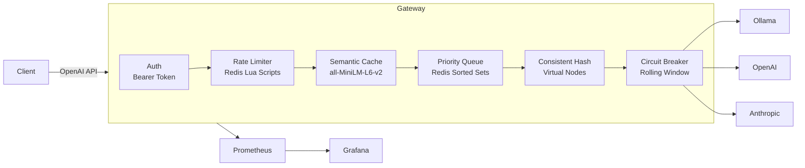

# Inference Gateway

A reverse proxy for LLM inference that sits in front of multiple backends (OpenAI, Anthropic, Ollama) and provides routing, caching, rate limiting, queuing, and failover through a single OpenAI-compatible API.

Clients send standard `/v1/chat/completions` requests. The gateway translates protocols, balances load, caches semantically similar responses, enforces per-tenant rate limits, and queues overflow requests with priority ordering.

## Demo

<video src="docs/grafana-dashboards-demo.mov" controls width="100%"></video>

> Grafana dashboards with live traffic: Gateway Overview (RPS, error rate, cache hit ratio, active backends), Per-Backend Drilldown (latency percentiles, circuit breaker state), Per-Tenant Usage (token consumption, rate limit hits).

## Architecture



### Request Pipeline

```
POST /v1/chat/completions
  |
  +-- Bearer token auth (tenant lookup)
  +-- Rate limit check (RPS, RPM, daily token budget)
  +-- Semantic cache lookup (cosine similarity > 0.95)
  |     +-- HIT: return cached response, X-Cache: HIT
  |     +-- MISS: continue
  +-- Priority queue (if backend at max_concurrent)
  |     +-- Enqueue with score = priority * 1e12 + timestamp
  |     +-- Wait for slot (asyncio.Event, 30s timeout)
  +-- Consistent hash routing (tenant:model -> backend)
  +-- Circuit breaker check (exclude OPEN backends)
  +-- Backend call (with protocol translation)
  |     +-- Non-streaming: 3-attempt failover retry
  |     +-- Streaming: SSE normalization + tee for caching
  +-- Record metrics, store in cache, release queue slot
```

## What's Implemented

**Routing & Load Balancing**
- Consistent hash ring with 150 virtual nodes per weight unit, O(log n) lookup via bisect
- Tenant affinity: same `tenant_id:model` routes to same backend for cache locality
- Weighted distribution configurable per backend

**Resilience**
- Per-backend circuit breaker: 60s rolling window, trips at 50% failure rate (min 10 requests)
- State machine: CLOSED -> OPEN -> HALF_OPEN -> CLOSED with exponential backoff (30s to 300s cap)
- 3-attempt failover for non-streaming requests (excludes failed backends from hash ring)
- Priority queue with backpressure: holds requests when backends are at capacity instead of rejecting
- Queue scoring: `priority * 1e12 + timestamp` (lower priority number = dequeued first, FIFO within tier)
- Queue limits: depth 100, timeout 30s, fail-open if Redis unavailable

**Caching**
- Semantic response cache using sentence-transformers (`all-MiniLM-L6-v2`, 384-dimensional embeddings)
- Cosine similarity threshold 0.95 (configurable via `CACHE_SIMILARITY_THRESHOLD`)
- Cache scoped by model + SHA256(system prompt) to prevent cross-context matches
- Per-tenant cache isolation option (`cache_isolation: tenant` in config)
- Stampede guard: Redis SETNX lock prevents duplicate backend calls for the same prompt
- Streaming cache: tee pattern buffers chunks while forwarding, stores assembled response after stream completes

**Rate Limiting**
- Three independent dimensions: RPS (1s sliding window), RPM (60s sliding window), daily token budget
- Redis Lua scripts for atomic check-and-increment (no TOCTOU races)
- Per-tenant configuration with graceful degradation if Redis unavailable

**Multi-Provider Translation**
- Ollama: NDJSON -> OpenAI SSE, `num_predict` mapping, duration-based token estimation
- Anthropic: Event-typed SSE -> OpenAI SSE, content block state machine, system prompt extraction
- OpenAI: passthrough with gateway-generated request IDs
- All providers normalized to OpenAI `/v1/chat/completions` request/response format

**Observability**
- 8 Prometheus metrics exported at `/metrics` (see Observability section below)
- 3 auto-provisioned Grafana dashboards (Gateway Overview, Per-Backend Drilldown, Per-Tenant Usage)
- Structured JSON logging via structlog with X-Request-ID propagation
- Response headers: `X-Request-ID`, `X-Backend`, `X-Cache`, `X-Cache-Similarity`, `X-Queue-Wait-Ms`, `X-Ratelimit-Remaining-Rps/Rpm`

**Configuration & Operations**
- Declarative YAML config for backends and tenants
- Hot-reload via `POST /admin/reload` or `SIGHUP` (atomic registry swap, zero-downtime)
- Admin endpoints: `/admin/backends`, `/admin/ring`, `/admin/cache/stats`, `/admin/queue`

## Quick Start

```bash
# Clone and start (14 Docker services: gateway, redis, 10 LLM backends, prometheus, grafana)
git clone https://github.com/kshitij3027/inference-gateway.git
cd inference-gateway
make up

# Wait for services to start (~15s)
sleep 15

# Send a request
curl -s http://localhost:8080/v1/chat/completions \
  -H "Content-Type: application/json" \
  -H "Authorization: Bearer test-beta-key" \
  -d '{
    "model": "mock-gpt-markdown",
    "messages": [{"role": "user", "content": "Hello!"}]
  }' | python3 -m json.tool

# Send the same request again (cache hit)
curl -s -D - http://localhost:8080/v1/chat/completions \
  -H "Content-Type: application/json" \
  -H "Authorization: Bearer test-beta-key" \
  -d '{
    "model": "mock-gpt-markdown",
    "messages": [{"role": "user", "content": "Hello!"}]
  }' 2>&1 | grep "X-Cache"
# Output: X-Cache: HIT
# Output: X-Cache-Similarity: 1.0000

# Check Prometheus metrics
curl -s http://localhost:8080/metrics/ | grep gateway_request_total

# View Grafana dashboards
open http://localhost:3000

# Check backend health
curl -s http://localhost:8080/admin/backends | python3 -m json.tool

# Check queue status
curl -s http://localhost:8080/admin/queue | python3 -m json.tool

# Run tests (inside Docker)
make test

# Tear down
make down
```

## API

| Endpoint | Method | Description |
|----------|--------|-------------|
| `/v1/chat/completions` | POST | OpenAI-compatible chat completions (streaming and non-streaming) |
| `/health` | GET | Liveness probe |
| `/metrics/` | GET | Prometheus metrics (exposition format) |
| `/admin/reload` | POST | Hot-reload config from disk |
| `/admin/backends` | GET | List backends with circuit breaker state |
| `/admin/ring` | GET | Consistent hash ring state per model |
| `/admin/cache/stats` | GET | Cache hit/miss counts and hit rate |
| `/admin/cache` | DELETE | Flush all cached responses |
| `/admin/queue` | GET | Per-backend concurrency and per-model queue depth |

## Observability

### Prometheus Metrics (8 families)

| Metric | Type | Labels | Description |
|--------|------|--------|-------------|
| `gateway_request_total` | Counter | tenant, model, backend, status_code, method | Total requests processed |
| `gateway_request_duration_seconds` | Histogram | tenant, model, backend | Request latency (buckets: 50ms to 60s) |
| `gateway_cache_operations_total` | Counter | model, status | Cache hits and misses |
| `gateway_rate_limit_rejections_total` | Counter | tenant, limit_type | Rate limit rejections by type |
| `gateway_circuit_breaker_state` | Gauge | backend | Circuit breaker state (0=closed, 1=open, 2=half_open) |
| `gateway_queue_depth` | Gauge | model | Current queue depth per model |
| `gateway_tokens_consumed_total` | Counter | tenant, model, type | Tokens consumed (prompt/completion) |
| `gateway_active_requests` | Gauge | backend | Active concurrent requests per backend |

### Grafana Dashboards (auto-provisioned)

1. **Gateway Overview** -- RPS by status code, error rate %, active backends, cache hit ratio, queue depth, latency P50/P95/P99
2. **Per-Backend Drilldown** -- latency percentiles, error rate, concurrent requests, circuit breaker state (with `$backend` selector)
3. **Per-Tenant Usage** -- request volume by model, tokens consumed, rate limit hits, top models table (with `$tenant` selector)

Access Grafana at `http://localhost:3000` (anonymous access enabled, no login required).

## Tech Stack

| Component | Technology |
|-----------|------------|
| API server | FastAPI + Uvicorn (async, Python 3.12) |
| HTTP client | httpx (async, connection pooling) |
| Cache + rate limiting + queue | Redis 7 |
| Semantic embeddings | sentence-transformers (all-MiniLM-L6-v2, CPU) |
| Metrics | Prometheus + prometheus-client |
| Dashboards | Grafana (JSON-provisioned) |
| Logging | structlog (JSON) |
| Token counting | tiktoken |
| Validation | Pydantic v2 |
| Orchestration | Docker Compose (14 services) |
| Testing | pytest + pytest-asyncio (286 tests) |

## Project Structure

```
inference-gateway/
├── gateway/
│   ├── main.py                  # FastAPI app, lifespan, middleware
│   ├── config.py                # YAML config loading, Registry
│   ├── auth.py                  # Bearer token authentication
│   ├── models.py                # Pydantic request/response models
│   ├── routing.py               # Consistent hash ring
│   ├── circuit_breaker.py       # Per-backend circuit breaker
│   ├── rate_limiter.py          # Redis sliding window rate limiter
│   ├── semantic_cache.py        # Embedding-based response cache
│   ├── priority_queue.py        # Concurrency tracking + overflow queue
│   ├── token_counting.py        # tiktoken + fallback counting
│   ├── backends/
│   │   ├── ollama.py            # Ollama protocol translation
│   │   ├── openai.py            # OpenAI passthrough + ID replacement
│   │   └── anthropic.py         # Anthropic Messages API translation
│   ├── routes/
│   │   ├── chat.py              # POST /v1/chat/completions
│   │   ├── health.py            # GET /health
│   │   └── admin.py             # Admin endpoints
│   └── observability/
│       ├── metrics.py           # 8 Prometheus metric definitions
│       └── logging.py           # structlog JSON setup
├── config/
│   └── backends.yaml            # Backend + tenant configuration
├── prometheus/
│   └── prometheus.yml           # Scrape config (gateway:8080, 5s interval)
├── grafana/
│   └── provisioning/
│       ├── datasources/         # Prometheus datasource
│       └── dashboards/          # 3 dashboard JSON files
├── tests/
│   ├── unit/                    # 19 test modules
│   └── integration/             # 7 test modules
├── docs/
│   └── grafana-dashboards-demo.mov
├── Dockerfile                   # Multi-stage (base, test, runtime)
├── docker-compose.yaml          # 14 services
├── Makefile                     # up, down, test, logs, build
├── DESIGN.md                    # Architecture decisions (1700+ lines)
└── requirements.txt
```

## Design Documentation

[`DESIGN.md`](DESIGN.md) covers architecture decisions, tradeoffs, failure modes, and interview-style Q&A for each component:

- Request/Response Translation (Ollama, OpenAI, Anthropic)
- Backend Configuration & Provider Registry
- Streaming Normalization (NDJSON, SSE, event-typed SSE)
- Consistent Hash Router (virtual nodes, tenant affinity)
- Circuit Breaker & Failover (state machine, exponential backoff)
- Distributed Rate Limiter (Lua scripts, sliding windows)
- Semantic Response Cache (embeddings, cosine similarity, stampede guard)
- Priority Queue with Backpressure (Redis sorted sets, asyncio.Event)
- Observability Stack (Prometheus metrics, Grafana dashboards-as-code)

## Testing

286 tests across 26 test modules, run inside Docker:

```bash
make test
# Builds test image, runs: pytest tests/ -v
# Covers: config, auth, routing, circuit breaker, rate limiter,
#         semantic cache, priority queue, metrics, admin endpoints,
#         streaming normalization, all 3 backend translators
```

| Category | Modules | Coverage |
|----------|---------|----------|
| Unit | 19 | Backend translators, streaming models, hash ring, circuit breaker, rate limiter, semantic cache, priority queue, metrics, config validation |
| Integration | 7 | Auth flow, health endpoint, streaming dispatch, rate limiting, cache hit/miss, queue behavior, circuit breaker failover |

## License

MIT
