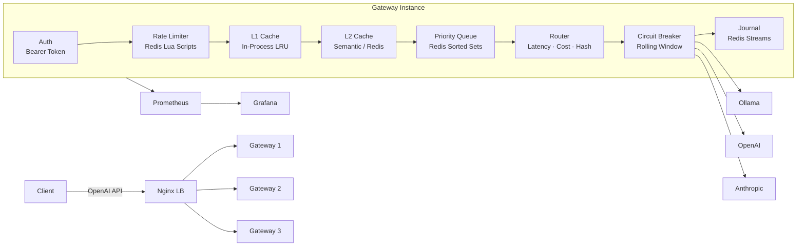

# Inference Gateway

A reverse proxy for LLM inference that sits in front of multiple backends (OpenAI, Anthropic, Ollama) and provides intelligent routing, two-tier caching, rate limiting, queuing, request journaling, and failover through a single OpenAI-compatible API. Runs as a multi-instance cluster behind an Nginx load balancer.

Clients send standard `/v1/chat/completions` requests. The gateway translates protocols, balances load, caches semantically similar responses, enforces per-tenant rate limits, and queues overflow requests with priority ordering.

## Demo

<video src="docs/grafana-dashboards-demo.mov" controls width="100%"></video>

> Grafana dashboards with live traffic: Gateway Overview (RPS, error rate, cache hit ratio, active backends), Per-Backend Drilldown (latency percentiles, circuit breaker state), Per-Tenant Usage (token consumption, rate limit hits).

## Measured Performance

Numbers from a local Docker Compose run (25+ services, mock LLM backends, ~400 requests):

| Metric | Value | Notes |
|--------|-------|-------|
| Gateway P50 latency | ~1s | End-to-end including mock backend response time |
| Gateway P95 latency | ~3.8s | Includes concurrent request queuing |
| Gateway P99 latency | ~4.8s | Tail latency under burst load |
| Cache hit latency | <50ms | Semantic cache hit bypasses backend entirely |
| Cache hit rate | 15-73% | Depends on prompt repetition (73% with repeated queries) |
| Throughput | 400+ req in test run | Across 10 backends, 2 tenants, 3 models |
| Tokens processed | 767K+ | Tracked per-tenant, per-model (prompt + completion) |
| Rate limit enforcement | 40 rejections | Per-tenant RPS/RPM/daily budget enforced via Redis |
| Active backends | 10/10 | Circuit breaker state: all CLOSED |
| Test suite | 440 passing | 29 unit + 11 integration test modules |

## Architecture



### Request Pipeline

```
POST /v1/chat/completions
  |
  +-- Bearer token auth (tenant lookup)
  +-- Rate limit check (RPS, RPM, daily token budget)
  +-- L1 cache lookup (in-process LRU, <1ms)
  |     +-- L1_HIT: return cached response, X-Cache: L1_HIT
  |     +-- MISS: continue to L2
  +-- L2 semantic cache lookup (Redis, cosine similarity > 0.95)
  |     +-- L2_HIT: return cached response, X-Cache: L2_HIT
  |     +-- MISS: continue
  +-- Priority queue (if backend at max_concurrent)
  |     +-- Enqueue with score = priority * 1e12 + timestamp
  |     +-- Wait for slot (asyncio.Event, 30s timeout)
  +-- Routing strategy (latency-aware / cost-aware / consistent hash)
  |     +-- Hedge mode: race two backends, first response wins
  +-- Circuit breaker check (exclude OPEN backends)
  +-- Backend call (with protocol translation)
  |     +-- Non-streaming: 3-attempt failover retry
  |     +-- Streaming: SSE normalization + TTFT/ITL recording + tee for caching
  +-- Record metrics, store in cache, journal request, release queue slot
```

## What's Implemented

**Routing & Load Balancing**
- Consistent hash ring with 150 virtual nodes per weight unit, O(log n) lookup via bisect
- Tenant affinity: same `tenant_id:model` routes to same backend for cache locality
- Weighted distribution configurable per backend
- Three pluggable routing strategies: `ConsistentHash`, `LatencyAware` (routes to lowest P95 backend), `CostAware` (routes to cheapest per-token backend)
- Hedge requests: race two backends in parallel, first response wins (`X-Hedge: true` header)
- Per-model routing configuration via `backends.yaml`
- Multi-instance: 3 gateway instances behind Nginx round-robin load balancer

**Resilience**
- Per-backend circuit breaker: 60s rolling window, trips at 50% failure rate (min 10 requests)
- State machine: CLOSED -> OPEN -> HALF_OPEN -> CLOSED with exponential backoff (30s to 300s cap)
- 3-attempt failover for non-streaming requests (excludes failed backends from hash ring)
- Priority queue with backpressure: holds requests when backends are at capacity instead of rejecting
- Queue scoring: `priority * 1e12 + timestamp` (lower priority number = dequeued first, FIFO within tier)
- Queue limits: depth 100, timeout 30s, fail-open if Redis unavailable

**Caching**
- Two-tier cache architecture:
  - L1: in-process LRU cache (500 entries, 3600s TTL) for zero-hop lookups
  - L2: Redis semantic cache using sentence-transformers (`all-MiniLM-L6-v2`, 384-dimensional embeddings)
- X-Cache header: `L1_HIT`, `L2_HIT`, or `MISS`
- Cosine similarity threshold 0.95 (configurable via `CACHE_SIMILARITY_THRESHOLD`)
- Cache scoped by model + SHA256(system prompt) to prevent cross-context matches
- Per-tenant cache isolation option (`cache_isolation: tenant` in config)
- Stampede guard: Redis SETNX lock prevents duplicate backend calls for the same prompt
- Streaming cache: tee pattern buffers chunks while forwarding, stores assembled response after stream completes
- Prefix caching for system prompt embeddings (avoids redundant embedding computation)
- Cache warming: `POST /admin/cache/warm` endpoint for preloading responses

**Rate Limiting**
- Three independent dimensions: RPS (1s sliding window), RPM (60s sliding window), daily token budget
- Redis Lua scripts for atomic check-and-increment (no TOCTOU races)
- Per-tenant configuration with graceful degradation if Redis unavailable

**Multi-Provider Translation**
- Ollama: NDJSON -> OpenAI SSE, `num_predict` mapping, duration-based token estimation
- Anthropic: Event-typed SSE -> OpenAI SSE, content block state machine, system prompt extraction
- OpenAI: passthrough with gateway-generated request IDs
- All providers normalized to OpenAI `/v1/chat/completions` request/response format

**Observability**
- 14 Prometheus metrics exported at `/metrics` (see Observability section below)
- 4 auto-provisioned Grafana dashboards (Gateway Overview, Per-Backend Drilldown, Per-Tenant Usage, Streaming Analytics)
- Streaming metrics: TTFT, ITL, generation duration histograms
- Structured JSON logging via structlog with X-Request-ID propagation
- Response headers: `X-Request-ID`, `X-Backend`, `X-Cache`, `X-Cache-Similarity`, `X-Queue-Wait-Ms`, `X-Ratelimit-Remaining-Rps/Rpm`, `X-Instance-ID`

**Configuration & Operations**
- Declarative YAML config for backends and tenants
- Hot-reload via `POST /admin/reload` or `SIGHUP` (atomic registry swap, zero-downtime)
- Admin endpoints: `/admin/backends`, `/admin/ring`, `/admin/cache/stats`, `/admin/queue`

**Request Journaling**
- Redis Streams-based audit trail recording full request lifecycle
- Admin endpoints: `GET /admin/journal/stats`, `GET /admin/journal` for querying

**Multi-Instance Deployment**
- 3 gateway instances behind Nginx load balancer (round-robin)
- Shared Redis for rate limiting, L2 cache, queue, journal
- Per-instance L1 cache and circuit breakers
- `X-Instance-ID` header identifying serving instance
- Rolling restart script (`make rolling-restart`) for zero-downtime deploys

**Chaos & Load Testing**
- ChaosHttpClient wrapper injecting latency (30%), 5xx errors (10%), timeouts (5%)
- Locust load test harness with multi-tenant, multi-model scenarios
- `make chaos` / `make loadtest` targets

## Quick Start

```bash
# Clone and start (25+ Docker services: 3 gateway instances, nginx LB, redis, 10 LLM backends, prometheus, grafana)
git clone https://github.com/kshitij3027/inference-gateway.git
cd inference-gateway
make up

# Wait for services to start (~15s)
sleep 15

# Send a request
curl -s http://localhost:8080/v1/chat/completions \
  -H "Content-Type: application/json" \
  -H "Authorization: Bearer test-beta-key" \
  -d '{
    "model": "mock-gpt-markdown",
    "messages": [{"role": "user", "content": "Hello!"}]
  }' | python3 -m json.tool

# Send the same request again (cache hit)
curl -s -D - http://localhost:8080/v1/chat/completions \
  -H "Content-Type: application/json" \
  -H "Authorization: Bearer test-beta-key" \
  -d '{
    "model": "mock-gpt-markdown",
    "messages": [{"role": "user", "content": "Hello!"}]
  }' 2>&1 | grep "X-Cache"
# Output: X-Cache: HIT
# Output: X-Cache-Similarity: 1.0000

# Check Prometheus metrics
curl -s http://localhost:8080/metrics/ | grep gateway_request_total

# View Grafana dashboards
open http://localhost:3000

# Check backend health
curl -s http://localhost:8080/admin/backends | python3 -m json.tool

# Check queue status
curl -s http://localhost:8080/admin/queue | python3 -m json.tool

# Run tests (inside Docker)
make test

# Tear down
make down

# Run chaos tests (fault injection)
make chaos

# Run load tests (Locust)
make loadtest

# Rolling restart (zero-downtime)
make rolling-restart
```

## API

| Endpoint | Method | Description |
|----------|--------|-------------|
| `/v1/chat/completions` | POST | OpenAI-compatible chat completions (streaming and non-streaming) |
| `/health` | GET | Liveness probe |
| `/metrics/` | GET | Prometheus metrics (exposition format) |
| `/admin/reload` | POST | Hot-reload config from disk |
| `/admin/backends` | GET | List backends with circuit breaker state |
| `/admin/ring` | GET | Consistent hash ring state per model |
| `/admin/cache/stats` | GET | Cache hit/miss counts and hit rate |
| `/admin/cache` | DELETE | Flush all cached responses |
| `/admin/queue` | GET | Per-backend concurrency and per-model queue depth |
| `/ready` | GET | Readiness probe |
| `/admin/journal/stats` | GET | Journal statistics (total entries, throughput) |
| `/admin/journal` | GET | Query journal entries (with filters) |
| `/admin/routing` | GET | Routing strategy state per model |
| `/admin/cache/warm` | POST | Pre-warm cache with prompt/response pairs |

## Observability

### Prometheus Metrics (14 families)

| Metric | Type | Labels | Description |
|--------|------|--------|-------------|
| `gateway_request_total` | Counter | tenant, model, backend, status_code, method | Total requests processed |
| `gateway_request_duration_seconds` | Histogram | tenant, model, backend | Request latency (buckets: 50ms to 60s) |
| `gateway_cache_operations_total` | Counter | model, status | Cache hits and misses |
| `gateway_rate_limit_rejections_total` | Counter | tenant, limit_type | Rate limit rejections by type |
| `gateway_circuit_breaker_state` | Gauge | backend | Circuit breaker state (0=closed, 1=open, 2=half_open) |
| `gateway_queue_depth` | Gauge | model | Current queue depth per model |
| `gateway_tokens_consumed_total` | Counter | tenant, model, type | Tokens consumed (prompt/completion) |
| `gateway_active_requests` | Gauge | backend | Active concurrent requests per backend |
| `gateway_hedge_requests_total` | Counter | model, strategy | Hedge requests initiated |
| `gateway_hedge_win_rate` | Counter | model, winner | Hedge race winners |
| `gateway_ttft_seconds` | Histogram | model, backend | Time to first token |
| `gateway_itl_seconds` | Histogram | model, backend | Inter-token latency |
| `gateway_generation_duration_seconds` | Histogram | model, backend | Total generation time (first to last token) |

### Grafana Dashboards (4, auto-provisioned)

1. **Gateway Overview** -- RPS by status code, error rate %, active backends, cache hit ratio, queue depth, latency P50/P95/P99
2. **Per-Backend Drilldown** -- latency percentiles, error rate, concurrent requests, circuit breaker state (with `$backend` selector)
3. **Per-Tenant Usage** -- request volume by model, tokens consumed, rate limit hits, top models table (with `$tenant` selector)
4. **Streaming Analytics** -- TTFT/ITL heatmaps, P50/P95/P99 timeseries, tokens/sec throughput

Access Grafana at `http://localhost:3000` (anonymous access enabled, no login required).

## Tech Stack

| Component | Technology |
|-----------|------------|
| API server | FastAPI + Uvicorn (async, Python 3.12) |
| HTTP client | httpx (async, connection pooling) |
| Cache + rate limiting + queue | Redis 7 |
| Semantic embeddings | sentence-transformers (all-MiniLM-L6-v2, CPU) |
| Metrics | Prometheus + prometheus-client |
| Dashboards | Grafana (JSON-provisioned) |
| Logging | structlog (JSON) |
| Token counting | tiktoken |
| Validation | Pydantic v2 |
| Load balancer | Nginx (round-robin) |
| Orchestration | Docker Compose (25+ services: 3 gateway instances, nginx LB, redis, backends, monitoring) |
| Testing | pytest + pytest-asyncio (440 tests) |
| Load testing | Locust |

## Project Structure

```
inference-gateway/
├── gateway/
│   ├── main.py                  # FastAPI app, lifespan, middleware
│   ├── config.py                # YAML config loading, Registry
│   ├── auth.py                  # Bearer token authentication
│   ├── models.py                # Pydantic request/response models
│   ├── routing.py               # Consistent hash ring
│   ├── circuit_breaker.py       # Per-backend circuit breaker
│   ├── rate_limiter.py          # Redis sliding window rate limiter
│   ├── semantic_cache.py        # Embedding-based response cache
│   ├── priority_queue.py        # Concurrency tracking + overflow queue
│   ├── token_counting.py        # tiktoken + fallback counting
│   ├── journal.py               # Request journal (Redis Streams)
│   ├── l1_cache.py              # L1 in-process LRU cache
│   ├── latency_tracker.py       # Rolling P95 latency tracker
│   ├── strategies.py            # Routing strategies (latency/cost-aware)
│   ├── chaos.py                 # Chaos testing HTTP client wrapper
│   ├── backends/
│   │   ├── ollama.py            # Ollama protocol translation
│   │   ├── openai.py            # OpenAI passthrough + ID replacement
│   │   └── anthropic.py         # Anthropic Messages API translation
│   ├── routes/
│   │   ├── chat.py              # POST /v1/chat/completions
│   │   ├── health.py            # GET /health
│   │   └── admin.py             # Admin endpoints
│   └── observability/
│       ├── metrics.py           # 14 Prometheus metric definitions
│       └── logging.py           # structlog JSON setup
├── config/
│   └── backends.yaml            # Backend + tenant configuration
├── prometheus/
│   └── prometheus.yml           # Scrape config (gateway:8080, 5s interval)
├── grafana/
│   └── provisioning/
│       ├── datasources/         # Prometheus datasource
│       └── dashboards/          # 4 dashboard JSON files
├── tests/
│   ├── unit/                    # 29 test modules
│   ├── integration/             # 11 test modules
│   └── load/
│       └── locustfile.py        # Locust load test scenarios
├── docs/
│   └── grafana-dashboards-demo.mov
├── nginx/
│   └── nginx.conf               # Nginx load balancer config
├── scripts/
│   └── rolling-restart.sh       # Zero-downtime rolling restart
├── Dockerfile                   # Multi-stage (base, test, runtime)
├── docker-compose.yaml          # 25+ services (3 gateway instances, nginx LB, redis, backends, monitoring)
├── Makefile                     # up, down, test, logs, build, chaos, loadtest, seed, status, rolling-restart
├── DESIGN.md                    # Architecture decisions (2700+ lines)
└── requirements.txt
```

## Design Documentation

[`DESIGN.md`](DESIGN.md) (2700+ lines) covers architecture decisions, tradeoffs, failure modes, and interview-style Q&A for each component:

- Request/Response Translation (Ollama, OpenAI, Anthropic)
- Backend Configuration & Provider Registry
- Streaming Normalization (NDJSON, SSE, event-typed SSE)
- Consistent Hash Router (virtual nodes, tenant affinity)
- Circuit Breaker & Failover (state machine, exponential backoff)
- Distributed Rate Limiter (Lua scripts, sliding windows)
- Semantic Response Cache (embeddings, cosine similarity, stampede guard)
- Priority Queue with Backpressure (Redis sorted sets, asyncio.Event)
- Observability Stack (Prometheus metrics, Grafana dashboards-as-code)
- Request Journaling (Redis Streams audit trail)
- Intelligent Routing (latency-aware, cost-aware strategies, hedging)
- Advanced Caching (two-tier L1/L2, prefix caching, cache warming)
- Resilience & Chaos Testing (fault injection, load testing)
- Multi-Instance Gateway (Nginx LB, rolling restarts)
- Token-Level Streaming Analytics (TTFT, ITL, generation duration)

## Testing

440 tests across 40 test modules, run inside Docker:

```bash
make test
# Builds test image, runs: pytest tests/ -v
# Covers: config, auth, routing, circuit breaker, rate limiter,
#         semantic cache, priority queue, metrics, admin endpoints,
#         streaming normalization, all 3 backend translators,
#         journal, L1 cache, latency tracker, routing strategies,
#         chaos client, hedge execution, streaming analytics, instance ID
```

| Category | Modules | Coverage |
|----------|---------|----------|
| Unit | 29 | Backend translators, streaming models, hash ring, circuit breaker, rate limiter, semantic cache, priority queue, metrics, config validation, journal, L1 cache, latency tracker, routing strategies, chaos client, hedge execution, streaming analytics, instance ID |
| Integration | 11 | Auth flow, health endpoint, streaming dispatch, rate limiting, cache hit/miss, queue behavior, circuit breaker failover, journal flow, routing strategies, multi-instance distribution, chaos resilience |
| Load | 1 | Locust scenarios (multi-tenant, multi-model, streaming) |

## License

MIT
